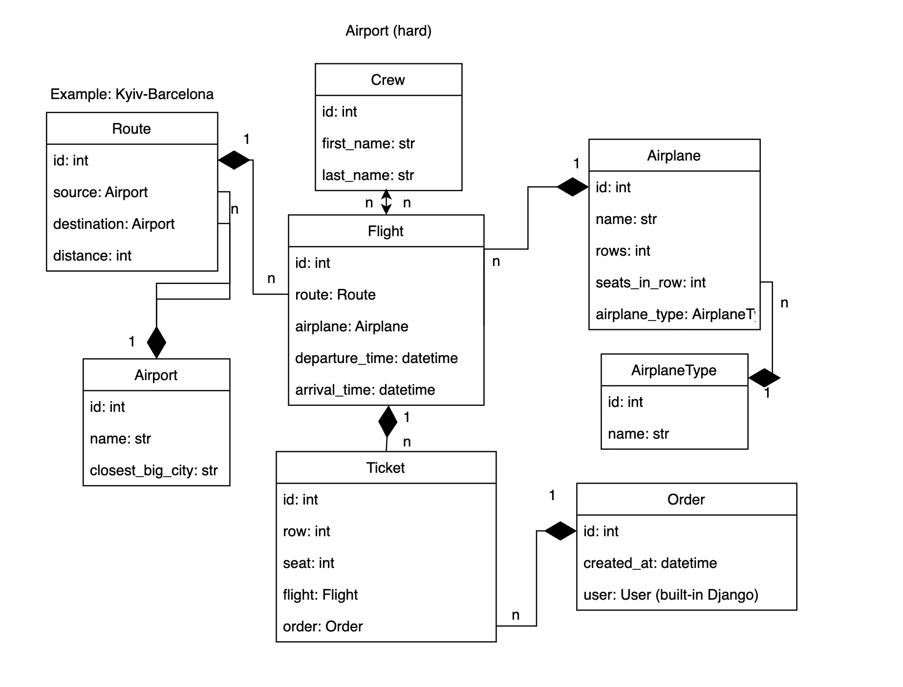

# airport-service
Implementation of a system for tracking flights from airports around the world

Getting access
- create user via /api/customer/register/
- get access token via /api/customer/token/